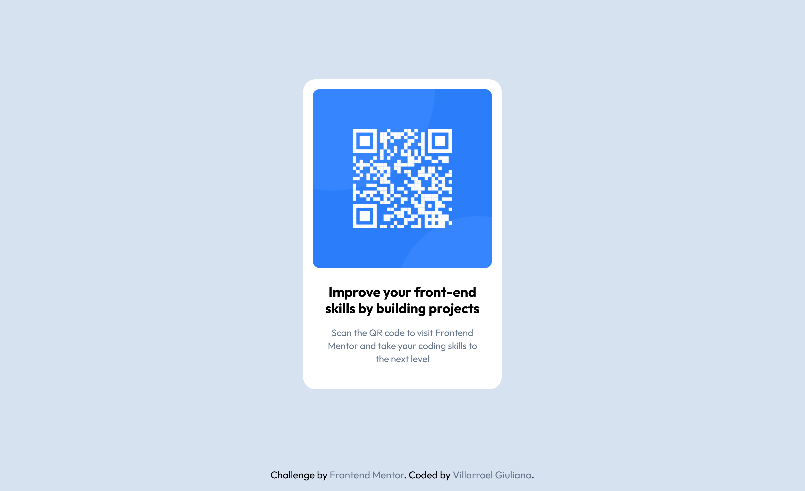

# Frontend Mentor - QR code component solution

This is a solution to the [QR code component challenge on Frontend Mentor](https://www.frontendmentor.io/challenges/qr-code-component-iux_sIO_H). Frontend Mentor challenges help you improve your coding skills by building realistic projects. 

## Table of Contents

- [Overview](#overview)
  - [What I learned](#what-i-learned)
- [Built with](#built-with)
- [Features](#features)
- [Acknowledgements](#acknowledgements)
- [Author](#author)

## Overview

I build a simple yet elegant QR code card component. The card features a clean, minimalist design with a QR code image, title, and description text, all wrapped in a sleek container with rounded corners.
The challenge was to create a card with an elegant and professional look while maintaining accessibility and responsiveness across all device sizes.

### Links

- Solution URL: [Solution URL](https://github.com/gvillarroel-dev/qr_code-component.git)
- Live Site URL: [Demo](#)

### What I learned

- **Semantic HTML Structure**
- **Mobile CSS Methodology:** Starting with mobile styles and progressively improving for larger screens.

## Built with

- HTML5 Semantic Elements
- CSS3 Mobile-First Design
- CSS Custom Properties (Variables)
- Flexbox

## Features

- **Semantic HTML Structure**: Built with proper HTML5 semantic elements ensuring accessibility and SEO optimization.
- **Mobile-First Responsive Design**: Developed starting from mobile breakpoints and scaling up, ensuring optimal performance on all devices.
- **Clean Card Design**: Modern card component with rounded corners and perfect spacing ratios for visual appeal.

This [Frontend Mentor](https://www.frontendmentor.io/challenges) project reinforced the importance of starting with solid foundations in HTML semantics and mobile-first CSS approaches.

## Acknowledgements

- [FrontendMentor.io](https://www.frontendmentor.io) for providing realistic design challenges that build essential frontend skills
- The web development community for promoting semantic HTML and mobile-first design principles

## Author

- Website [qr code card component](#)
- GitHub [@gvillarroel-dev](https://github.com/gvillarroel-dev)
- Frontend Mentor - [@nana-v1](https://www.frontendmentor.io/profile/nana-v1)